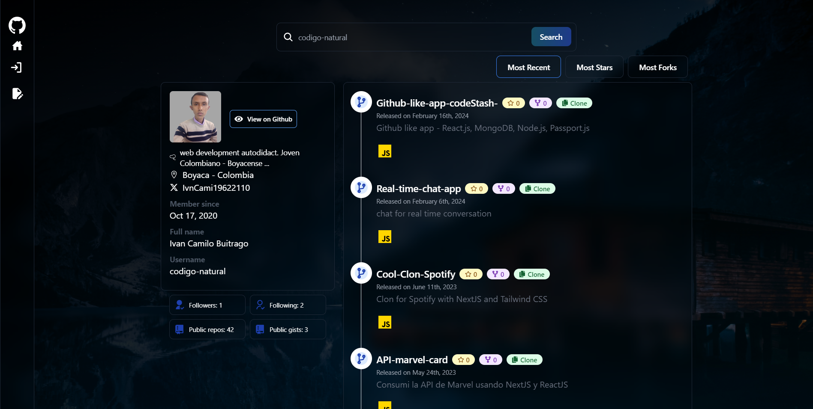

# Github Like App

Cree esta aplicacion de forma didactica en mis tiempos libres haciendo uso de Tecnologias como ReactJS con Typescript y Tailwindcss para agregar diseño a la aplicacion, el backend de la aplicacion esta realizado con Nodejs junto con express y se conecta a una base de datos no relacional (MongoDb)

